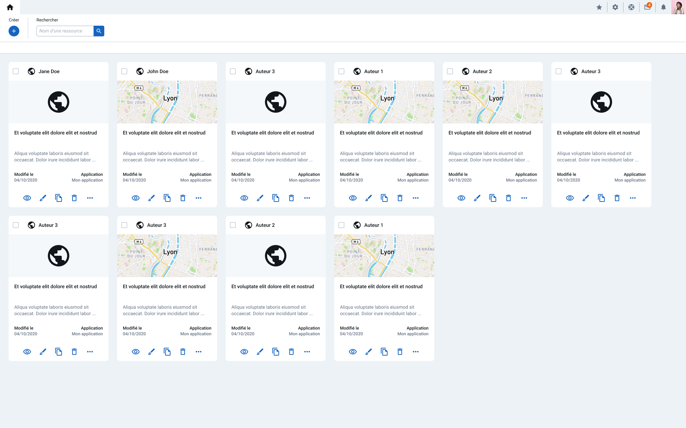

## Test technique : Card List
Solution web légère développée avec Lit et Vite.
Projet conçu dans le cadre d'une évaluation technique.
**Tâche principale :** Développement d'une interface affichant une liste de cartes, avec fonctionnalités de recherche et de création de nouvelles cartes.

### Tâches à completer :
- [x] Le bouton "créer" permet d'instancier un composant "carte" dans l'interface. Le contenu peut être généré aléatoirement.
- [x] Les autres boutons sont statiques, pas de comportement attendus à implémenter dessus.
- [x] Les images sur les cards sont des images statiques.
- [x] La barre de recherche permet de chercher dans le titre des "cartes".
- [x] (optionnel) l'interface responsive.
- [x] (optionnel) HTML sémantique / accessibilité.
- [ ] (optionnel) l'interface est thématisée.

## :art: Interface :


## :ledger: Technologies principales :
- **Vite :** Bundle et dev server
- **Lit :** Framework (Components : JS + Less)
- **Faker :** Librairie pour génerer fake data

## :file_folder: Structure
```txt
src/
│── components/
│   ├── App                     👈 Vue principal
|       ├── App.js
|       ├── App.less
|   ├── Card                    👈 Componsant Carte
|       ├── Card.js
|       ├── Card.less
|   ├── MenuLinks               👈 Composant pour le liens du menu de navigation
|       ├── MenuLinks.js
|       ├── MenuLinks.less
│
│── data/
│   ├── data_card.js            👈 fichier pour la création de données faux pour les cartes (Librairie : Faker)
│
│── fonts/                      👈 Polices
|
|── icons/                       👈 Fichiers .svg 
|
|── images/                      👈 Images statiques 
│
│── styles/                    
│   ├── base.less               👈 Styles globales
│   ├── mixins.less             👈 Mixins pour la gestions des pictos / Init de la police
|   ├── variables.less          👈 Variables globales
|
│── index.html
│── main.js
│── vite.config.js
```

## :computer: Instalation
```bash
git clone 
npm install
npm run dev
```
